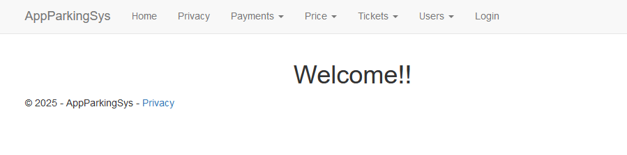
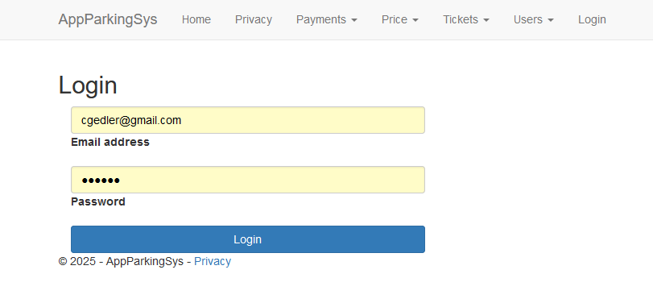
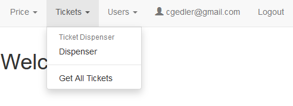
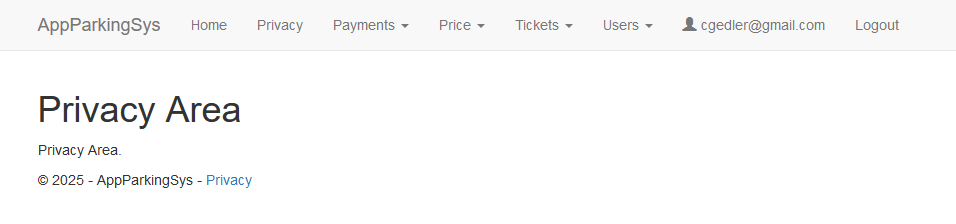
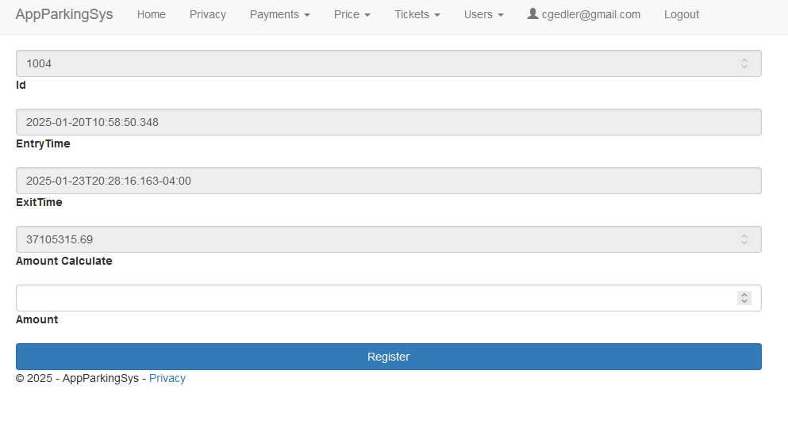
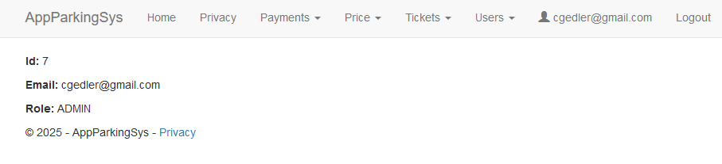
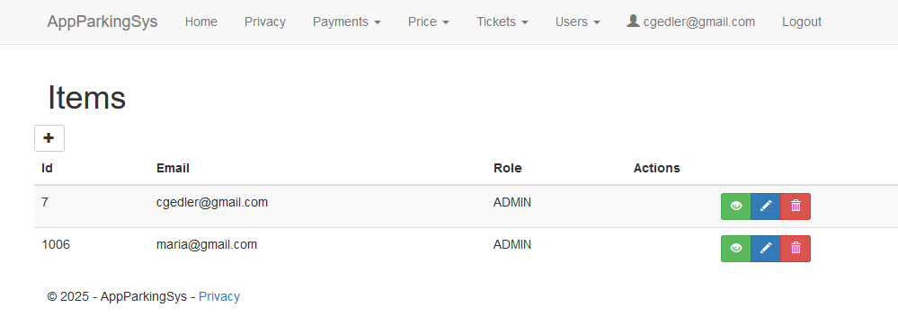

# AppParkingSys-Front

## Descripci&#243;n general
Este proyecto es una aplicaci&#243;n web desarrollada con ASP.NET Core 8 utilizando Razor Pages, dise&#241;ada para conectarse a una API backend tambi&#233;n desarrollada en ASP.NET Core 8. La aplicaci&#243;n web implementa una arquitectura limpia (Clean Architecture) con separaci&#243;n de responsabilidades, facilitando la mantenibilidad y escalabilidad del c&#243;digo.

### Nombre del Proyecto: AppParkingSys-Front es una aplicaci&#243;n ASP.NET 8 Web Razor Pages que sirve una API de backend ASP.NET 8 con tokens JWT

## Estructura del Proyecto
El proyecto est&#225; organizado en carpetas para separar y organizar el c&#243;digo de manera efectiva:

- **Interfaces:** Contiene las definiciones de las interfaces utilizadas en los servicios.

- **Servicios:** Implementa la l&#243;gica de negocio y se comunica con la API backend.

- **Modelos:** Define los modelos de datos utilizados en la aplicaci&#243;n.

- **Razor Pages:** Agrupadas en carpetas seg&#250;n el m&#243;dulo correspondiente, estas p&#225;ginas heredan de PageModel y contienen el c&#243;digo para las peticiones HTTP (GET, POST, PUT, DELETE).

## Seguridad y Autenticaci&#243;n

La aplicaci&#243;n maneja un inicio de sesi&#243;n con usuario. La API responde con un JWT (JSON Web Token), que la aplicaci&#243;n almacena en una cookie de sesi&#243;n y utiliza para acceder a las dem&#225;s p&#225;ginas protegidas.

### Tecnolog&#237;as Utilizadas:

- **ASP.NET Core 8:** Framework principal utilizado para desarrollar la aplicaci&#243;n web.

- **Razor Pages:** Para crear las interfaces de usuario.

- **Newtonsoft.Json:** Utilizado para la serializaci&#243;n y deserializaci&#243;n de los datos JSON.

- **Serilog:** Utilizado para el logging y la generaci&#243;n de logs detallados.

- **Bootstrap v3.4.1:** Para el maquetado HTML y dise&#241;o responsivo.

- **jQuery v1.12.4:** Para brindar compatibilidad con navegadores antiguos.

## Funcionalidades Principales

**1. Registro y Autenticaci&#243;n de Usuarios:**

- Gesti&#243;n de usuarios del sistema, incluyendo registro, actualizaci&#243;n y eliminaci&#243;n.

- Utiliza BCrypt.Net para cifrar los passwords antes de enviarlos a la API backend.

**2. Sistema Dispensador de Tickets de Estacionamiento**

- Simula un sistema dispensador de tickets de un estacionamiento.

- Contiene funcionalidades b&#225;sicas para la simulaci&#243;n del dispensador de tickets.

> Este proyecto frontend con ASP.NET Core 8 est&#225; dise&#241;ado para ser robusto, escalable y mantenible. La implementaci&#243;n de una arquitectura limpia (Clean Architecture) y el uso de tecnolog&#237;as modernas como Razor Pages, Newtonsoft.Json, Serilog, Bootstrap, jQuery y JWT garantizan un desarrollo eficiente y una operaci&#243;n segura del sistema.

> El proyecto tambi&#233;n incluye funcionalidades b&#225;sicas para un sistema dispensador de tickets de estacionamiento, lo que lo hace vers&#225;til para diversos escenarios de uso.

# Screenshots

