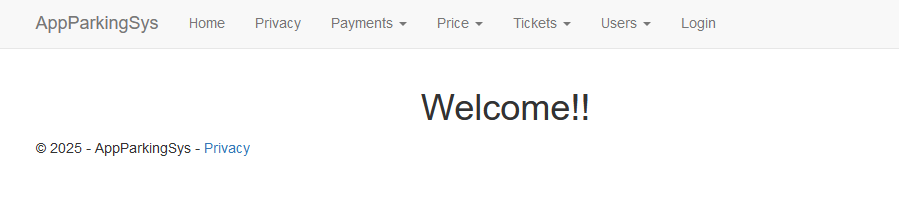
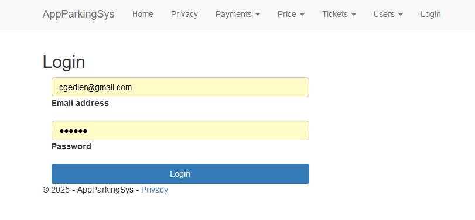
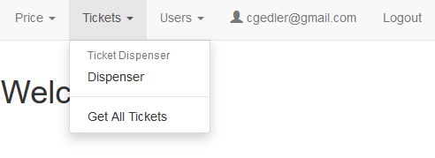
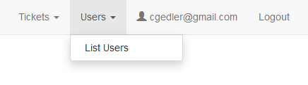
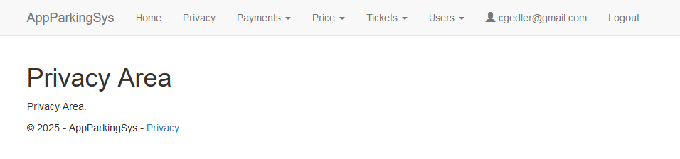
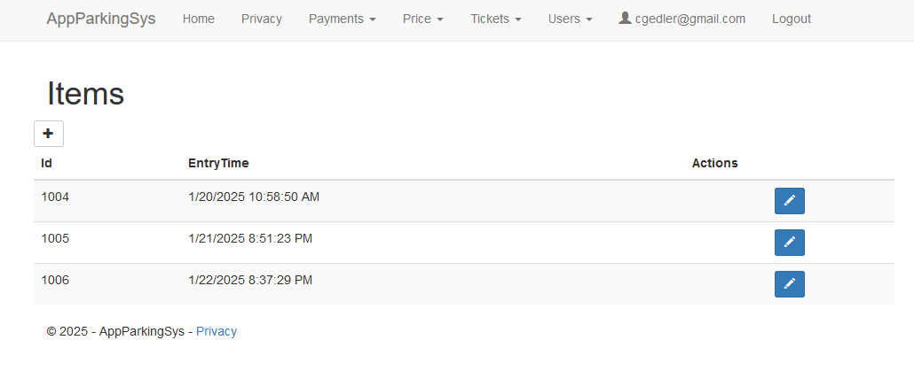
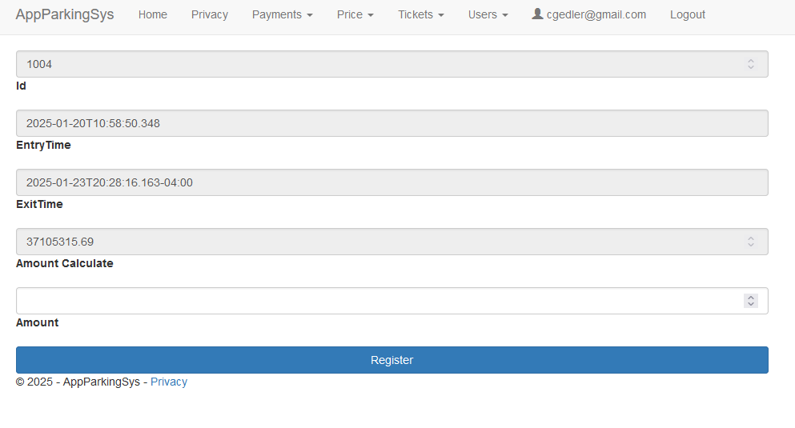
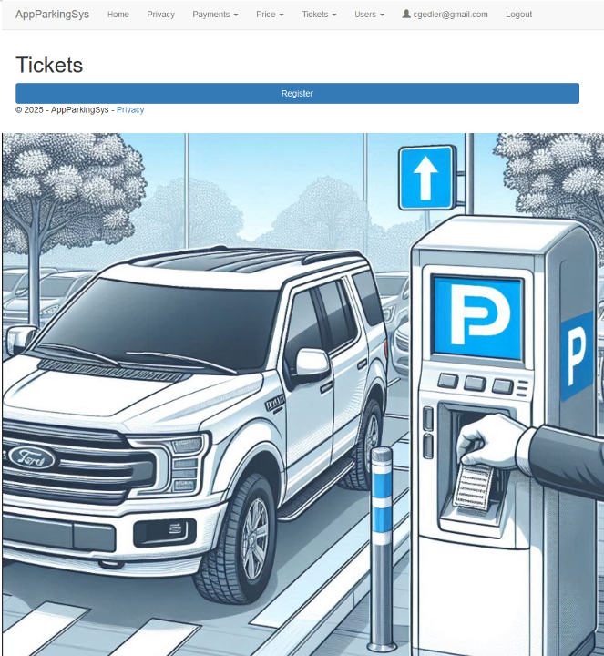
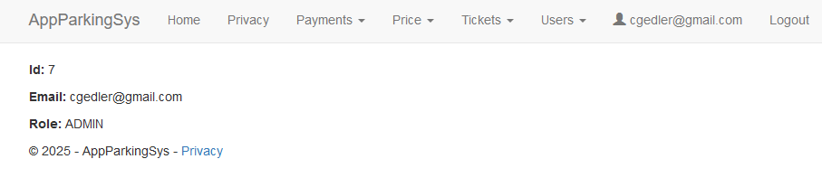
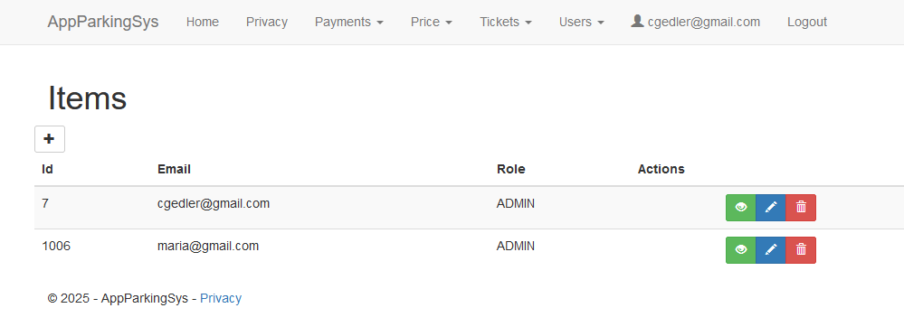

# AppParkingSys-Front

## Overview
This project is a web application developed with ASP.NET Core 8 using Razor Pages, designed to connect to a backend API also developed in ASP.NET Core 8. The web application implements a Clean Architecture with separation of responsibilities, facilitating code maintainability and scalability.

### Project Name: AppParkingSys-Front is a ASP.NET 8 Web Razor Pages application that serves a backend API ASP.NET 8 with JWT Tokens

## Project Structure
The project is organized into folders to effectively separate and organize the code:

- **Interfaces:** Contains the definitions of the interfaces used in the services.

- **Services:** Implements the business logic and communicates with the backend API.

- **Models:** Defines the data models used in the application.

- **Razor Pages:** Grouped into folders according to the corresponding module, these pages inherit from PageModel and contain the code for HTTP requests (GET, POST, PUT, DELETE).

## Security and Authentication

The application handles a user login. The API responds with a JWT (JSON Web Token), which the application stores in a session cookie and uses to access the other protected pages.

### Technologies Used:

- **ASP.NET Core 8:** Main framework used to develop the web application.

- **Razor Pages:** To create the user interfaces.

- **Newtonsoft.Json:** Used for serialization and deserialization of JSON data.

- **Serilog:** Used for logging and generating detailed logs.

- **Bootstrap v3.4.1:** For HTML layout and responsive design.

- **jQuery v1.12.4:** To provide compatibility with older browsers.

## Main Features

**1. User Registration and Authentication:**

- System user management, including registration, update, and deletion.

- Uses BCrypt.Net to encrypt passwords before sending them to the backend API.

**2. Parking Ticket Dispenser System**

- Simulates a parking ticket dispenser system.

- Contains basic functionality for simulating the ticket dispenser.

> This ASP.NET Core 8 frontend project is designed to be robust, scalable, and maintainable. The implementation of a Clean Architecture and the use of modern technologies such as Razor Pages, Newtonsoft.Json, Serilog, Bootstrap, jQuery, and JWT ensure efficient development and secure operation of the system.

> The project also includes basic functionality for a parking ticket dispenser system, making it versatile for various usage scenarios.

# Screenshots

